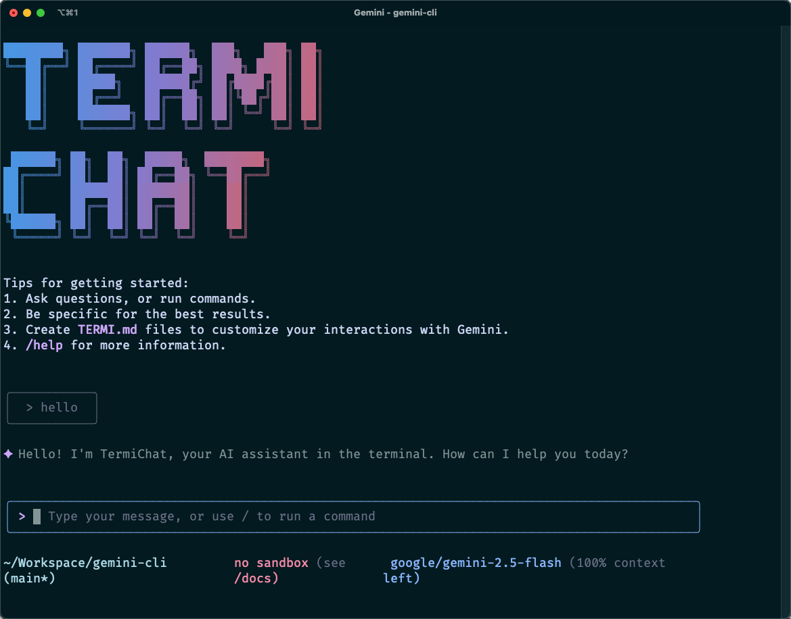

# TermiChat

[](https://github.com/horizon0514/termichat/actions/workflows/ci.yml)



**TermiChat** - AI Chat in Your Terminal 🚀

TermiChat is a powerful AI chat client that brings Google Gemini's conversational AI directly to your terminal. Built on the solid foundation of Gemini CLI, TermiChat is optimized specifically for seamless AI conversations with a beautiful terminal interface.

## ✨ Features

- **🎯 Chat-Optimized Experience**: Clean, focused interface designed specifically for AI conversations
- **🔧 Powerful Tool Integration**: Built-in tools for file operations, web search, and more via MCP protocol
- **🎨 Beautiful Terminal UI**: React-powered terminal interface with 16 customizable themes
- **💾 Conversation Management**: Save, load, and manage your chat sessions
- **🔒 Multiple Auth Options**: Support for Google accounts, API keys, and Vertex AI
- **⚡ High Performance**: Optimized for long conversations with smart memory management
- **🌐 Multimodal Support**: Handle text, images, and documents in your conversations
- **🔌 Extensible**: Plugin architecture via Model Context Protocol (MCP)

## 🚀 Quick Start

### Install with npm
```bash
npm install -g termichat
termichat
```

### Install with Homebrew
```bash
brew install termichat
termichat
```

### Try without installing
```bash
npx termichat
```

## 🎯 Perfect for

- **Quick AI Consultations**: Get instant answers without leaving your terminal
- **Code Discussions**: Chat about your code with AI assistance
- **Research & Learning**: Ask questions and explore topics interactively
- **Creative Writing**: Brainstorm and collaborate with AI on creative projects
- **Problem Solving**: Work through complex problems step-by-step

## 🎨 Beautiful Themes

TermiChat comes with 16 built-in themes:
- Default Light/Dark
- GitHub Light/Dark  
- Dracula
- Atom One Dark
- Ayu Light/Dark
- And many more...

Change themes instantly with `/theme` command!

## 🔧 Key Commands

- `/help` - Show available commands
- `/theme` - Change color theme
- `/clear` - Clear chat history
- `/save <name>` - Save current conversation
- `/load <name>` - Load saved conversation
- `/auth` - Manage authentication

## 🛠️ Technical Features

- **Built on React + Ink**: Modern terminal UI framework
- **TypeScript**: Type-safe development experience
- **Memory Optimization**: Smart context management for long conversations
- **Cross-Platform**: Works on macOS, Linux, and Windows
- **Secure**: Sandboxed execution environment
- **Fast**: Optimized for real-time conversations

## 📖 Documentation

- [Configuration Guide](./docs/configuration.md)
- [Theme Customization](./docs/themes.md)
- [Authentication Setup](./docs/authentication.md)
- [Tool Integration](./docs/tools.md)
- [Troubleshooting](./docs/troubleshooting.md)

## 🤝 Contributing

TermiChat is open source! We welcome contributions from the community.

1. Fork the repository
2. Create your feature branch (`git checkout -b feature/amazing-feature`)
3. Commit your changes (`git commit -m 'Add amazing feature'`)
4. Push to the branch (`git push origin feature/amazing-feature`)
5. Open a Pull Request

See [CONTRIBUTING.md](./CONTRIBUTING.md) for detailed guidelines.

## 📄 License

TermiChat is licensed under the [Apache License 2.0](./LICENSE).

## 🙏 Acknowledgments

TermiChat is built upon the excellent foundation of [Google's Gemini CLI](https://github.com/google-gemini/gemini-cli). We thank the Gemini CLI team for creating such a robust platform for AI interactions.

---

**Made with ❤️ for the terminal community**

*Chat better. Code better. Think better.*
